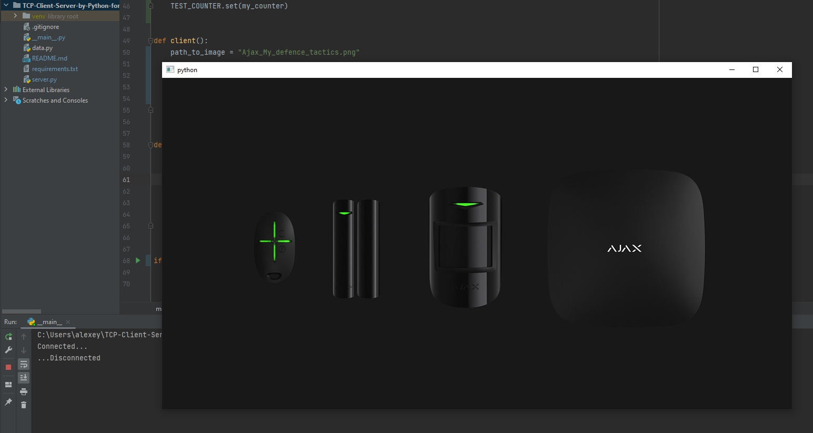

### How to use
```bash
git clone https://github.com/Aleksei-Isaev/TCP-Client-Server-by-Python-for-Ajax-Malevich.git
cd TCP-Client-Server-by-Python-for-Ajax-Malevich.git/
python -m venv venv
source venv/bin/activate - on macOS (venv\Scripts\activate - on Windows)
pip install -r requirements.txt
```

### TASK
Create TCP client which gets pictures from the TCP server(port 8888)

Description:
	When the client connects to the server, it should send the command “next”(N times). The server returns chunks (max size 2048 bytes), where a first byte is a serial number(max 256 chunks). When all chunks are returned - the server closes the connection. 
	It is needed to remove the serial numbers, glue all chunks in the correct order in the one picture, and return the path to the picture from function “client”. After this QT application will be opened with the picture.

## Demo

